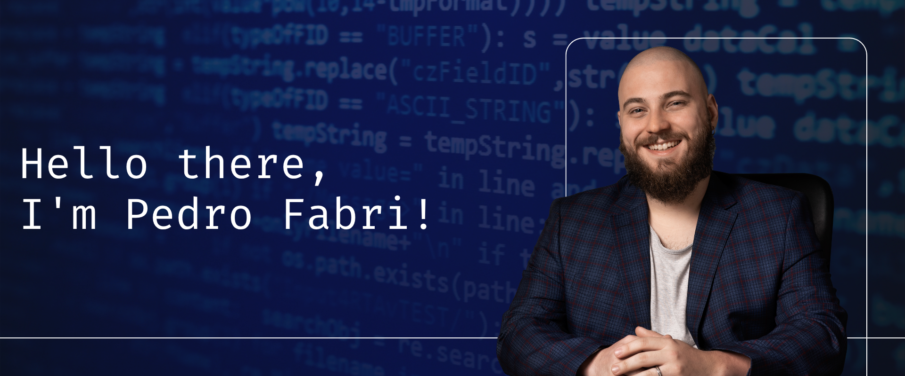
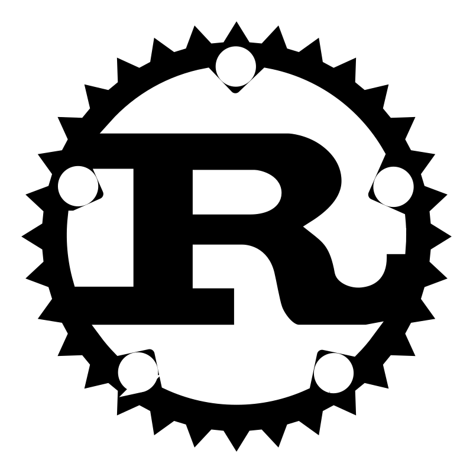
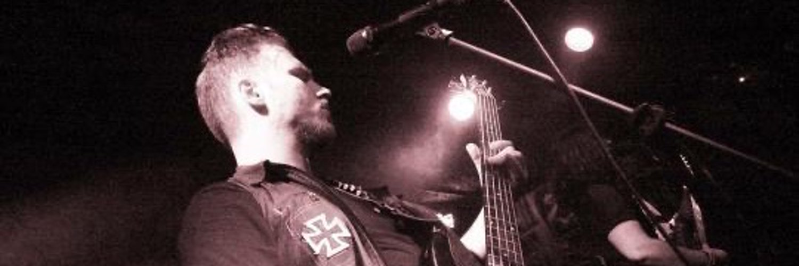

## About me 🤓

I'm a fullstack developer with a heavy focus on backend, specializing in TypeScript and Rust and building scalable solutions. 🚀

When I'm not coding APIs or crafting elegant systems, I'm sharing knowledge as a teacher at [Fabri Academy](https://pay.hotmart.com/A94627852G), an online fullstack JS/TS course I created to empower future developers! 💡

Oh, and when it's time to unwind, you'll find me gaming or working on my next indie game dev project. 🎮✨

> "There is no knowledge that isn't power" - Ralph Waldo Emerson

## Interests

    
    
    
    
    
    

## Reach Out!

    
    
    
    

## Fun Fact

### By day, I wrote code; by night, I rocked stages! 🎸💻
For years, I balanced life as a programmer during the week and a bassist/back vocals for the metal band [Dislaze](https://open.spotify.com/intl-pt/artist/6Rutm9sy6ohxc0S2FTEofE) on the weekends — touring, recording, and living the metal dream 🤘🏻🤘🏻."

<!-- ONE DAY: -->

<!--

## About me ⚖️💾

Formerly a professional full-stack dev, I am currently transitioning my career into the **Legal field** (Law). 

Today, programming has returned to what it does best: being a fascinating hobby. I am a deep enthusiast of **retrodev, emulators, and retrohardware**, spending my free time exploring old hardware constraints and low-level code. 

Alongside my retro explorations, I also build **conventional gamedev projects**, developing modern indie games and mechanics just for the fun of crafting interactive experiences.

Most of my experimental, nostalgic, and over-engineered projects live under my fictional 90s tech company, **[Fabricom Systems](https://github.com/fabricom-systems)**. 

## My Current Toolbox & Interests ⚙️

    
    
    

## Reach Out!

    
    
    
    

## Fun Fact 🎸💻

### By day, I write code; by night, I rock stages!
For years, I balanced life as a programmer during the week and a bassist/back vocals for the metal band [Dislaze](https://open.spotify.com/intl-pt/artist/6Rutm9sy6ohxc0S2FTEofE) on the weekends — touring, recording, and living the metal dream 🤘🏻

-->
